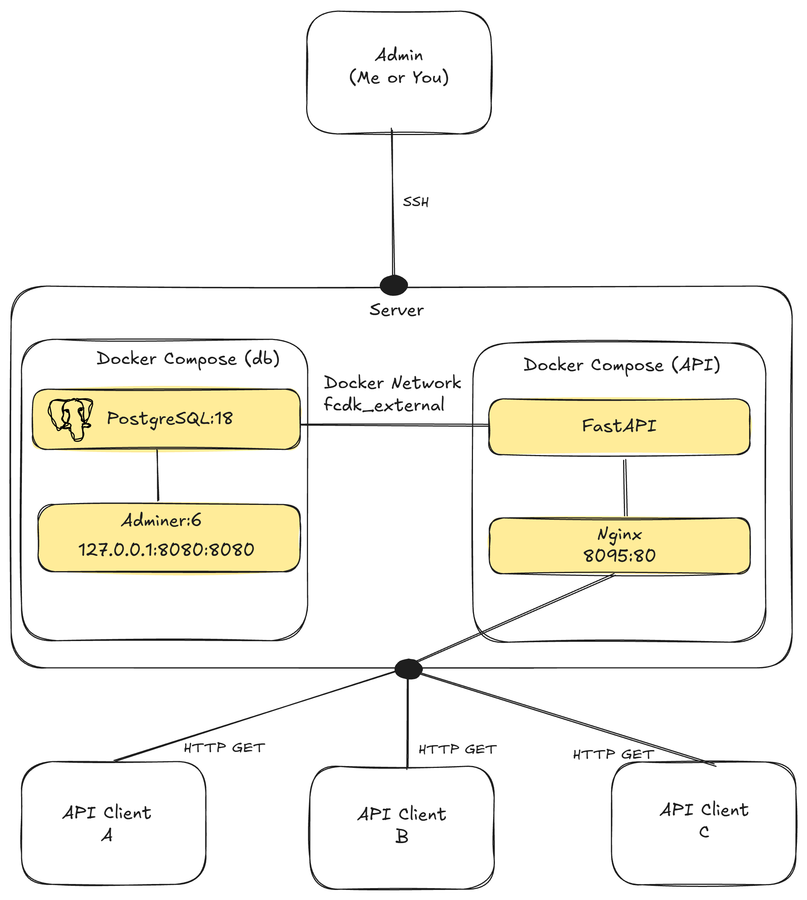
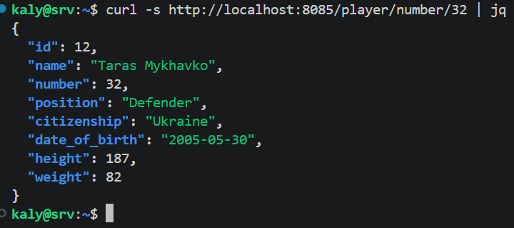
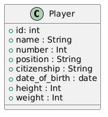

# Football team management 

## Database and Rest API for football team management
This repository provides an example of a football team management system built using a microservices architecture. The system is fully containerized with Docker to ensure deployment on any system with Docker installed.

The database comes with initinal data of the **FC Dynamo Kyiv** squad for the 2026/2027 season (as of September 2026).

This project was created strictly for educational purposes under the [MIT License](LICENSE). New feauters may or not be added or changed in future.

## Project Architecture


As a database this project use PostgreSQL 18 and Adminer 6 for lightweight database management and administration. Project database is ``fcdk_db`` with table ``players``

The REST API is built with FastAPI and runs inside a Docker container based on Python image. As an example of API Gateway Nginx is used. For a basic security request rate limit is implameted. 

Only one port ``8085`` is open for API users outside the server loopback network. If you need have acces to database via Adminer UI you have to be conected to the server via SSH and launch port forwarding.

## Getting started
* Change `exemple.env` in ``db`` and ``API`` folders with real .``env`` files

* Create Docker external network
```bash
docker network create external-fcdk
```
* Start Docker compose file ``db`` and ``API`` folders respectively
```bash
docker compose up -d
```
* Or just start project by running ``init.sh`` script in project folder

* API is listening on ``http://your_server_ip:8085``. For example , to get player by squad (32 in an example) number use:
``http://your_server_ip:8085/player/number/32``



* Go to ``http://your_server_ip:8085/docs`` see API documentation (acces to the doccumentaion is available only if ``ENVIRONMENT`` variable for api service in ``API\docker-compose.yml`` is not set to ``Production``).

## Endpoint reference
 This is class diagram for database (for now, only class ``Player``)



All endpoints are relative to ``http://your_server_ip:8085``.
 
| Method | Endpoint                          | Description                                                  |
|--------|------------------------------------|----------------------------------------------------------------|
| GET    | `/players`                          | List of all players  |
| GET    | `/player/id/{player_id}`             | Get a single player by database ID                            |
| GET    | `/players/position/{position_name}`  | Get all players matching a position `Forward`, `Midfielder`, `Defender`, `Goalkeeper` |
| GET    | `/player/number/{number}`           | Get a single player by squad number                            |
| GET    | `/players/name/{player_name}`        | Get all players matching a name (partial, case-insensitive)    |
 
### Examples
 
```bash
# All players, first page
curl http://your_server_ip:8085/players
 
# Player with squad number 32 (Taras Mykhavko)
curl http://your_server_ip:8085/player/number/32
 
# All defenders
curl http://your_server_ip:8085/players/position/Defender
 
# Search by name (Justin Lonwijk)
curl http://your_server_ip:8085/players/name/Lonwijk
```
